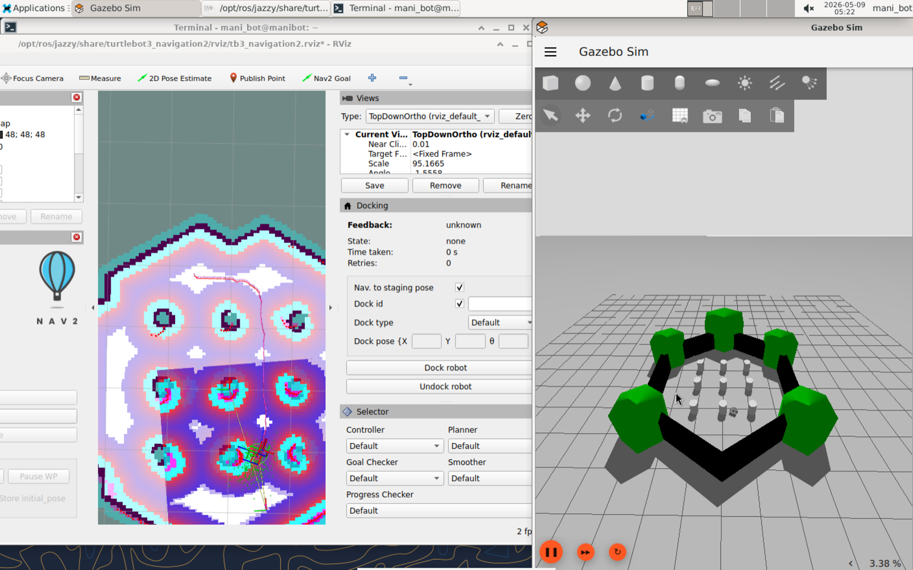
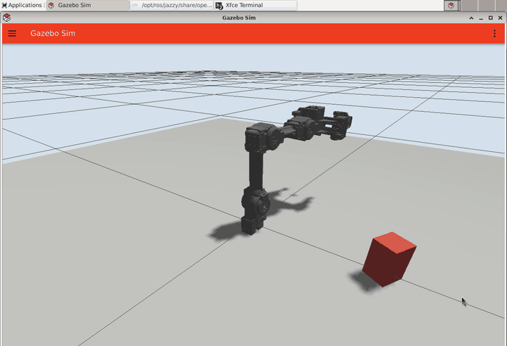

# manibot-vla-lab

OpenMANIPULATOR X、TurtleBot3、Gazebo、ROS 2 Jazzy、iPhone テレオペを使って、  
「手で動かすロボット」から「見て、言葉を理解して、行動するロボット」へ育てていくための実験ログです。

最終的な目標は VLA（Vision-Language-Action）モデルの実装です。  
ただし、いきなり賢いモデルを置くのではなく、まずは身体、環境、操作、把持、ナビゲーション、データ収集を順番に作っていきます。



[](docs/media/open-manipulator-grasp-demo.mov)

Full video: [OpenMANIPULATOR X grasp demo](docs/media/open-manipulator-grasp-demo.mov)

## Research Direction

このリポジトリは、完成済みパッケージというより「ロボット知能を作っていく過程」を残すための場所です。

研究の流れは次のイメージです。

1. **Simulation**
   ROS 2 Jazzy と Gazebo で、ロボットが動ける世界を作る。

2. **Navigation**
   TurtleBot3 Burger + Nav2 で、地図上の目標地点へ移動する。

3. **Manipulation**
   OpenMANIPULATOR X で、物体に近づき、掴み、持ち上げる。

4. **Teleoperation**
   iPhone の ARKit/CoreMotion を使って、エンドエフェクタを直感的に操作する。

5. **Data Collection**
   人間の操作、ロボットの状態、物体の位置、成功/失敗を記録する。

6. **Learning**
   imitation learning、behavior cloning、VLA へ進む。

7. **Embodied VLA**
   視覚、言語、行動をつなぎ、「何をすればいいか」をロボットが実行する。

雑に言うと、ロボットに「目」と「手」と「ちょっとした根性」を順番に渡していくプロジェクトです。

## Current Milestones

- Ubuntu 24.04 ARM64 VM on UTM
- ROS 2 Jazzy
- Gazebo Sim
- TurtleBot3 Burger + Nav2 demo
- OpenMANIPULATOR X simulation
- Random object placement for grasp trials
- Automatic grasp sequence
- Gripper pressure regulation using joint effort
- iPhone teleoperation app
- Mac-to-VM UDP bridge
- End-effector 3D position control from iPhone motion
- End-effector pitch control from iPhone vertical rotation
- Gripper open/close from iPhone orientation
- OpenMANIPULATOR X URDF joint-limit based IK

## Repository Layout

```text
.
├── iphone_gazebo_bridge/
│   └── iphone_gazebo_bridge.py
├── iphone_gazebo_teleop/
│   ├── iPhoneGazeboTeleop.xcodeproj/
│   ├── MotionSender.swift
│   ├── ContentView.swift
│   └── README.md
├── omx_grasp_lab/
│   ├── bin/
│   ├── omx_grasp_lab.sdf
│   ├── worlds/
│   └── ros2_ws/
├── vm_launchers/
├── docs/media/
└── ubuntu-24.04-vm-setup.md
```

## System Architecture

```text
iPhone
  └─ SwiftUI + ARKit/CoreMotion
      └─ UDP JSON :8765

Mac
  └─ iphone_gazebo_bridge.py
      └─ UDP forward to Ubuntu VM :8766

Ubuntu VM
  └─ omx-iphone-teleop-server
      ├─ /arm_controller/follow_joint_trajectory
      └─ /gripper_controller/gripper_cmd

Gazebo / ROS 2
  ├─ OpenMANIPULATOR X
  ├─ TurtleBot3 Burger
  ├─ Nav2
  └─ grasp objects
```

## iPhone Teleoperation

iPhone アプリは、手の動きをロボットのエンドエフェクタに対応させます。

- iPhone の 3D 位置: エンドエフェクタの xyz 位置
- iPhone の縦回転: エンドエフェクタの pitch
- iPhone の横/反転: グリッパ開閉
- boost toggle: 操作量を少し大きくする
- reset button: 現在のiPhone姿勢を操作原点に戻す

この操作は将来的に「人間のデモ軌道」を集めるための入口になります。

## Grasp Control

グリッパは単に閉じるだけではなく、`/joint_states` の effort を見ながら圧力を調整します。

目的は次の2つです。

- 物体を落とさないくらい強く掴む
- 物体やシミュレーションを壊すほど強く押し込まない

現在は、強い保持力を基本にしつつ、トルクが大きすぎる時だけ小さく逃がす制御にしています。

## Quick Start

Ubuntu VM 側で Gazebo を起動します。

```bash
omx-grasp-gz
```

別ターミナルで iPhone 操作サーバーを起動します。

```bash
omx-iphone-teleop-server
```

Mac 側で UDP ブリッジを起動します。

```bash
python3 iphone_gazebo_bridge/iphone_gazebo_bridge.py
```

Xcode で `iphone_gazebo_teleop/iPhoneGazeboTeleop.xcodeproj` を開き、iPhone 実機へ Run します。  
アプリにはブリッジが表示する Mac IP と port `8765` を入力します。

## Useful VM Commands

```bash
omx-grasp-gz              # Gazebo world
omx-iphone-teleop-server  # iPhone teleop receiver
omx-reset-objects         # Randomize/reset objects
omx-open                  # Open gripper
omx-close                 # Close gripper with pressure regulation
omx-random-grasp          # Auto grasp current random target
omx-random-grasp-loop     # Repeat random grasp trials
omx-mobile-grasp-gz       # Mobile manipulator world
```

## Development Notes

このプロジェクトでは、いきなりVLAモデルを書くより先に、以下を大事にします。

- シミュレーションが実際に動くこと
- 操作が人間にとって直感的であること
- 把持の成功/失敗を観察できること
- ロボットの状態と行動を記録できること
- あとで学習データにできる形で実験を積むこと

## Roadmap

- Gazebo 内カメラ/RGB-D入力の追加
- 物体状態とロボット状態のロギング
- iPhone テレオペによるデモ軌道収集
- grasp success / failure の自動ラベル付け
- imitation learning / behavior cloning
- 言語指示から行動列を作る planner
- VLA モデルによる end-to-end 操作
- 実機 OpenMANIPULATOR X への移行
- TurtleBot3 + Arm の mobile manipulation

## Note

このリポジトリには VM の SSH 秘密鍵、Ubuntu ISO、UTM installer、Xcode の DerivedData は含めません。  
必要な環境は `ubuntu-24.04-vm-setup.md` を参考に各自で用意します。
